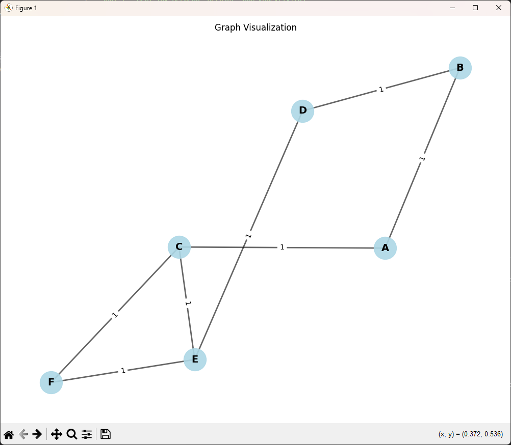
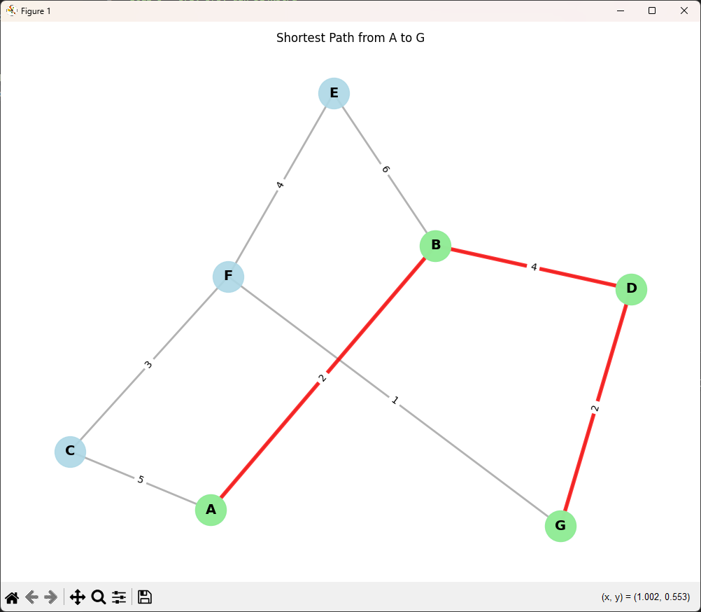

# Proyek: Implementasi Teori Graf Menggunakan Python

Proyek ini adalah implementasi lengkap dari sistem analisis graf menggunakan Python dan library NetworkX. Proyek ini mencakup kelas `Graf` dengan berbagai metode untuk analisis graf dan visualisasi.

## Struktur Proyek

```
python-graph-theory/
│
├── graf.py                      # Kelas Graf utama dengan semua metode
├── contoh_implementasi.py       # Contoh penggunaan sesuai spesifikasi
├── soal1_undirected_graph.py    # Solusi untuk Soal 1
├── soal3_bfs_dfs_dijkstra.py    # Solusi untuk Soal 3
├── requirements.txt             # Dependencies
└── README.md                    # Dokumentasi ini
```

## Instalasi

### Prerequisites

- Python 3.7 atau lebih baru
- pip (Python package manager)

### Langkah Instalasi

1. Clone atau download repository ini

2. Install dependencies:

```bash
pip install -r requirements.txt
```

## Penggunaan

### Contoh Dasar (Sesuai Spesifikasi)

```python
from graf import Graf

# Membuat Object
graph = Graf()

# Menambah Node (titik)
graph.add_node(1)
graph.add_node(2)
graph.add_node(3)
graph.add_node(4)
graph.add_node(5)

# Menambah sisi (Edge)
graph.add_edge(1, 2, weight=4.5)
graph.add_edge(1, 3, weight=3.2)
graph.add_edge(2, 4, weight=2.7)
graph.add_edge(3, 4, weight=1.8)
graph.add_edge(1, 4, weight=6.7)
graph.add_edge(3, 5, weight=2.7)

# Visualisasi Graf
graph.visualize_graph()

# Jalur terpendek
path = graph.shortest_path(1, 5)
print(path)  # Output: [1, 3, 5]

# Visualisasi Jalur terpendek
graph.visual_shortest_path(1, 5)
```

### Menjalankan Contoh Implementasi

```bash
python contoh_implementasi.py
```

### Menjalankan Solusi Soal

```bash
# Soal 1 - Graf Tak Berarah, Derajat, dan Konektivitas
python soal1_undirected_graph.py

# Soal 3 - BFS, DFS, dan Dijkstra
python soal3_bfs_dfs_dijkstra.py
```

## Fitur Kelas Graf

### Metode Dasar

- `__init__(directed=False)` - Inisialisasi graf (directed atau undirected)
- `add_node(node)` - Menambah node ke graf
- `add_edge(node1, node2, weight=1)` - Menambah edge dengan bobot
- `visualize_graph()` - Visualisasi graf menggunakan matplotlib
- `shortest_path(source, target)` - Mencari jalur terpendek
- `visual_shortest_path(source, target)` - Visualisasi jalur terpendek

### Metode Analisis Graf

- `get_degree(node=None)` - Mendapatkan derajat node
- `is_connected()` - Mengecek apakah graf terhubung
- `find_cycles()` - Mencari semua cycle dalam graf
- `has_cycle()` - Mengecek apakah graf memiliki cycle
- `get_neighbors(node)` - Mendapatkan tetangga dari node

### Metode Traversal

- `bfs(start_node)` - Breadth-First Search
- `dfs(start_node)` - Depth-First Search

### Metode Algoritma

- `dijkstra(source, target=None)` - Algoritma Dijkstra untuk jalur terpendek

### Metode Informasi

- `get_nodes()` - Mendapatkan semua node
- `get_edges()` - Mendapatkan semua edge
- `number_of_nodes()` - Jumlah node
- `number_of_edges()` - Jumlah edge

## Hasil Penyelesaian Soal

### Soal 1: Graf Tak Berarah, Derajat, dan Konektivitas

**Graf:**

- V = {A, B, C, D, E, F}
- E = {(A, B),(A, C),(B, D),(C, E),(D, E),(E, F),(C, F)}

**Pertanyaan:**

- a. Gambarkan graf
- b. Tentukan derajat setiap simpul
- c. Tentukan apakah graf memiliki cycle
- d. Tentukan apakah graf connected

**Cara Menjalankan:**

```bash
python soal1_undirected_graph.py
```

**Hasil Visualisasi dan Output:**



**Output Program Lengkap:**

```
============================================================
SOAL 1 - Graf Tak Berarah, Derajat, dan Konektivitas
============================================================

V = {A, B, C, D, E, F}
E = {(A, B),(A, C),(B, D),(C, E),(D, E),(E, F),(C, F)}

a. Visualisasi Graf
   (Graf akan ditampilkan dalam window terpisah)

b. Derajat Setiap Simpul:
   Derajat simpul A: 2
   Derajat simpul B: 2
   Derajat simpul C: 3
   Derajat simpul D: 2
   Derajat simpul E: 3
   Derajat simpul F: 2

c. Deteksi Cycle:
   Graf MEMILIKI cycle
   Cycle yang ditemukan:
   Cycle 1: A -> B -> D -> E -> C -> A
   Cycle 2: A -> B -> D -> E -> F -> C -> A
   Cycle 3: C -> E -> F -> C

d. Konektivitas Graf:
   Graf adalah CONNECTED
   Penjelasan: Semua simpul dapat dijangkau dari simpul manapun.
   Setiap pasangan simpul memiliki jalur yang menghubungkannya.

============================================================

INFORMASI TAMBAHAN:
Jumlah simpul (nodes): 6
Jumlah sisi (edges): 7

Tetangga setiap simpul:
   A: ['B', 'C']
   B: ['A', 'D']
   C: ['A', 'E', 'F']
   D: ['B', 'E']
   E: ['C', 'D', 'F']
   F: ['C', 'E']
============================================================
```

**Jawaban:**

**b. Derajat Setiap Simpul:**

- Derajat simpul A: 2
- Derajat simpul B: 2
- Derajat simpul C: 3
- Derajat simpul D: 2
- Derajat simpul E: 3
- Derajat simpul F: 2

**c. Deteksi Cycle:**

- Graf MEMILIKI cycle
- Cycle yang ditemukan:
  - Cycle 1: A -> B -> D -> E -> C -> A
  - Cycle 2: A -> B -> D -> E -> F -> C -> A
  - Cycle 3: C -> E -> F -> C

**d. Konektivitas Graf:**

- Graf adalah CONNECTED
- Penjelasan: Semua simpul dapat dijangkau dari simpul manapun. Setiap pasangan simpul memiliki jalur yang menghubungkannya.

---

### Soal 3: BFS, DFS, dan Dijkstra

**Graf Berbobot:**

- V = {A, B, C, D, E, F, G}
- E = {(A, B, 2),(A, C, 5),(B, D, 4),(B, E, 6),(C, F, 3),(D, G, 2),(E, F, 4),(F, G, 1)}

**Pertanyaan:**

- a. Gambarkan graf
- b. BFS dari simpul A
- c. DFS dari simpul A
- d. Dijkstra dari A (jarak minimum dan jalur terpendek ke G)

**Cara Menjalankan:**

```bash
python soal3_bfs_dfs_dijkstra.py
```

**Hasil Visualisasi dan Output:**



**Output Program Lengkap:**

```
============================================================
SOAL 3 - BFS, DFS, dan Dijkstra
============================================================

V = {A, B, C, D, E, F, G}
E = {(A, B, 2),(A, C, 5),(B, D, 4),(B, E, 6),(C, F, 3),
     (D, G, 2),(E, F, 4),(F, G, 1)}

a. Visualisasi Graf Berbobot
   (Graf akan ditampilkan dalam window terpisah)

b. Breadth-First Search (BFS) dari simpul A:
   Urutan kunjungan: A -> B -> C -> D -> E -> F -> G
   Penjelasan: BFS mengunjungi simpul level per level,
   dimulai dari A, kemudian tetangga langsung A (B, C),
   lalu tetangga dari B dan C, dan seterusnya.

c. Depth-First Search (DFS) dari simpul A:
   Urutan kunjungan: A -> B -> D -> G -> F -> C -> E
   Penjelasan: DFS mengeksplorasi sejauh mungkin sebelum backtrack.
   Dengan urutan tetangga alfabetis, DFS akan mengikuti
   cabang pertama hingga habis sebelum pindah ke cabang lain.

d. Algoritma Dijkstra dari simpul A:

   1. Jarak minimum dari A ke seluruh simpul:
      A ke A: 0
      A ke B: 2
      A ke C: 5
      A ke D: 6
      A ke E: 8
      A ke F: 8
      A ke G: 8

   2. Jalur terpendek dari A ke G:
      Jalur: A -> B -> D -> G
      Total jarak: 8

      Penjelasan langkah jalur:
      A -> B: bobot 2
      B -> D: bobot 4
      D -> G: bobot 2

   Visualisasi jalur terpendek A ke G:
   (Graf akan ditampilkan dalam window terpisah)

============================================================

INFORMASI TAMBAHAN:
Jumlah simpul (nodes): 7
Jumlah sisi (edges): 8

Tetangga setiap simpul dengan bobot:
   A: B(w=2), C(w=5)
   B: A(w=2), D(w=4), E(w=6)
   C: A(w=5), F(w=3)
   D: B(w=4), G(w=2)
   E: B(w=6), F(w=4)
   F: C(w=3), E(w=4), G(w=1)
   G: D(w=2), F(w=1)
============================================================
```

**Jawaban:**

**b. Breadth-First Search (BFS) dari simpul A:**

- Urutan kunjungan: A -> B -> C -> D -> E -> F -> G

**c. Depth-First Search (DFS) dari simpul A:**

- Urutan kunjungan: A -> B -> D -> G -> F -> C -> E

**d. Algoritma Dijkstra dari simpul A:**

1. **Jarak minimum dari A ke seluruh simpul:**

   - A ke A: 0
   - A ke B: 2
   - A ke C: 5
   - A ke D: 6
   - A ke E: 8
   - A ke F: 8
   - A ke G: 8

2. **Jalur terpendek dari A ke G:**
   - Jalur: A -> B -> D -> G
   - Total jarak: 8
   - Detail: A -> B (bobot 2) -> D (bobot 4) -> G (bobot 2)

## Dependencies

- networkx: Library untuk membuat dan menganalisis graf
- matplotlib: Library untuk visualisasi graf

Lihat `requirements.txt` untuk versi lengkap.

## Contoh Output Program

### Contoh Implementasi Dasar

```python
from graf import Graf

# Membuat graf
graph = Graf()

# Menambah nodes
graph.add_node(1)
graph.add_node(2)
graph.add_node(3)
graph.add_node(4)
graph.add_node(5)

# Menambah edges dengan bobot
graph.add_edge(1, 2, weight=4.5)
graph.add_edge(1, 3, weight=3.2)
graph.add_edge(2, 4, weight=2.7)
graph.add_edge(3, 4, weight=1.8)
graph.add_edge(1, 4, weight=6.7)
graph.add_edge(3, 5, weight=2.7)

# Mencari jalur terpendek
path = graph.shortest_path(1, 5)
print(path)
# Output: [1, 3, 5]

# Visualisasi graf
graph.visualize_graph()

# Visualisasi jalur terpendek
graph.visual_shortest_path(1, 5)
```

### Output Metode-Metode Graf

```python
# BFS (Breadth-First Search)
>>> graph.bfs('A')
['A', 'B', 'C', 'D', 'E', 'F', 'G']

# DFS (Depth-First Search)
>>> graph.dfs('A')
['A', 'B', 'D', 'G', 'F', 'E', 'C']

# Dijkstra ke semua node
>>> graph.dijkstra('A')
{'A': 0, 'B': 2, 'C': 5, 'D': 6, 'E': 8, 'F': 8, 'G': 8}

# Dijkstra ke node tertentu
>>> graph.dijkstra('A', 'G')
(8, ['A', 'B', 'D', 'G'])

# Cek konektivitas
>>> graph.is_connected()
True

# Cek cycle
>>> graph.has_cycle()
True

# Derajat node
>>> graph.get_degree('A')
2

# Derajat semua node
>>> graph.get_degree()
{'A': 2, 'B': 3, 'C': 2, 'D': 2, 'E': 3, 'F': 3, 'G': 2}

# Tetangga node
>>> graph.get_neighbors('A')
['B', 'C']

# Jumlah node dan edge
>>> graph.number_of_nodes()
7
>>> graph.number_of_edges()
8
```

## Tips Penggunaan

1. **Graf Berarah vs Tak Berarah:**

   ```python
   # Graf tak berarah (default)
   graph = Graf(directed=False)

   # Graf berarah
   graph_directed = Graf(directed=True)
   ```

2. **Bobot Edge:**

   - Jika tidak ditentukan, bobot default adalah 1
   - Untuk algoritma yang tidak mempertimbangkan bobot, bobot akan diabaikan

3. **Visualisasi:**
   - Visualisasi akan membuka window matplotlib
   - Close window untuk melanjutkan eksekusi program

## Kontribusi

Proyek ini dibuat untuk tujuan pembelajaran teori graf. Silakan modifikasi dan kembangkan sesuai kebutuhan.

## Lisensi

Proyek ini dibuat untuk keperluan akademis [LICENSE](https://github.com/wyattmatt/python-graph-theory/blob/main/LICENSE).

---

**Dibuat dengan:** Python, NetworkX, Matplotlib
**Tanggal:** Desember 2025
